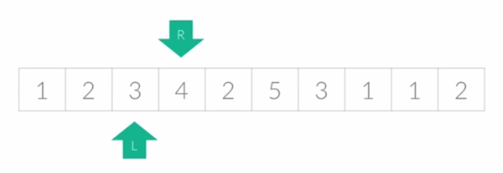

# 투포인터

리스트에 순차적으로 접근해야 할 때 두 개의 점의 위치를 조작하여 처리하는 알고리즘

보통 리스트나 배열의 `시작부터 끝까지 차례대로 진행하는 방식보다 효율적인 알고리즘이 필요할 때 사용된다.`

이 알고리즘은 주로 정렬된 리스트에서 더욱 효율적으로 사용됩니다.

 

## 예제) 정렬된 정수 배열에서 두 수의 합이 특정한 값을 갖는 인덱스를 찾기
